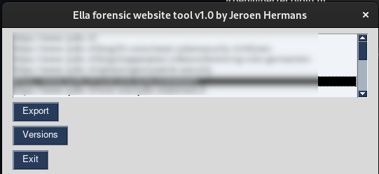

# Ella
A forensic tool to crawl and store website content

## What is "Ella"
Apart from this tool, Ella is a cat known for being very inquisitive. It only seemed appropriate to name the tool after her.  

## Why have you made this tool?
In 2023, after a year of researching, i worked with investigative journalist platform "[Follow The Money](https://www.ftm.eu "Follow The Money")" (FTM) to publish an article about security malpractises of the Chinese firm [Yealink](https://www.yealink.com "Yealink").
As a direct consequence of this article i was legally threatened with consequences that would ruin my life completely.
Because Yealink and Dutch distributor [Lydis](https://www.lydis.nl "Lydis") were sometimes creative with the truth i felt i had to help them a bit remembering facts.
## So what does this tool do?
This tool takes a list of url's from urls.csv. It then starts a new, headless, Firefox browser and visits the url. The result of this crawl is stored in a .har file. This is an industry-standard way of storing pretty much everything about the visit to the website, including headers, timing information, http-codes, etc.   
Ella then downloads all external PDF files and also stores them. This package of PDF files and .har files is then pushed to a remote github.com repository, so that it no longer resides on hardware that i personally administrate. This automatically means the data crawled is now stored, timestamped and immutable on an external, public server available for, say, a judge to look at.   
Additionally Ella implements the SPN2 API of the [Wayback Machine](https://web.archive.org/). This way you can save another instance of a webpage on another infrastructure outside of your own control. In order to use the Wayback Machine's SPN2 API you need to get an access- and secret key. You can obtain these for free by visiting https://archive.org/account/s3.php .
## So how do i install Ella?
It is easiest to create a python3 venv environment and run everything in there:

(optionally if not yet installed:)

    sudo apt install python3-venv python3-tk firefox
Next install Ella and it's venv:

    git clone https://github.com/trideeindhoven/ella.git
    cd ella
    python3 -m venv venv
    venv/bin/pip3 install selenium-wire GitPython requests PySimpleGUI pycryptodome
    cp config.py.example config.py
Now edit config.py and
create urls.py (see example)

    venv/bin/python3 ./ella.py

## So is there a GUI?
As a matter of fact: there is! Although the main focus is on making correct HAR files and making sure they are committed to github a rudimentary GUI has been made:   
  
The GUI shows you what url's are in the git repository. If you select a url and click on "Export", all files in the HAR file are exported to a temp folder. Then the default browser is opened.
The GUI at the moment can also query the commit versions of a url on the local repository. For every previously crawled version it is also possible to export that
particular version and view it in your default browser.

TODO:
- Simple comparison of commit versions of a url (possibly with an alert if a url changes)
